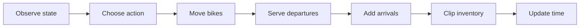

# Citi Bike Rebalancing with Reinforcement Learning

This project studies a two-station Citi Bike rebalancing problem using Citi Bike trip data. The goal is to learn when and how many bikes should be moved between two stations to reduce unmet demand while keeping rebalancing costs low compared with simple baseline policies.

The project focuses on three questions:

1. Can reinforcement learning reduce unmet demand compared with simple baseline policies?
2. Can the learned policy respond reasonably to morning and evening peak-hour patterns?
3. As a DQN extension, can the policy use day-of-week information to capture weekday and weekend demand differences?

---

## Project Structure

```text
citibike-rl/
├── README.md
├── data/
│   ├── raw/
│   │   ├── JC-202501-citibike-tripdata.csv
│   │   ├── JC-202502-citibike-tripdata.csv
│   │   └── ...
│   └── processed/
│       ├── train_hourly.csv
│       ├── test_hourly.csv
│       └── station_info.csv
├── notebooks/
│   ├── 01_data_processing.ipynb
│   ├── 02_sarsa_qlearning.ipynb
│   └── 03_dqn_extension.ipynb
└── results/
    ├── tabular_summary.csv
    ├── tabular_test_daily_unmet.csv
    ├── final_model_comparison.csv
    ├── final_test_daily_unmet.csv
    └── dqn_model/
        └── dqn_two_station_seed42.json
```

---

## How to Run

### Option 1: Run the full pipeline from raw data

Download the monthly Citi Bike trip data CSV files and place them in:

```text
data/raw/
```

Then run the notebooks in order:

```text
1. notebooks/01_data_processing.ipynb
2. notebooks/02_sarsa_qlearning.ipynb
3. notebooks/03_dqn_extension.ipynb
```

### Option 2: Run only the modeling notebooks

If the processed files are already available, you can start from the modeling notebooks, please run the notebooks in order:

```text
2. notebooks/02_sarsa_qlearning.ipynb
3. notebooks/03_dqn_extension.ipynb
```

Required processed files:

```text
data/processed/train_hourly.csv
data/processed/test_hourly.csv
data/processed/station_info.csv
```

---

## Data

The raw data comes from [Citi Bike trip history data](https://s3.amazonaws.com/tripdata/index.html). This project uses Citi Bike trip data from **January 2025 to February 2026**.

Raw monthly CSV files are placed in:

```text
data/raw/
```

The data processing notebook cleans the raw trip records, selects two stations using the training period only, and aggregates trips into hourly station-level departures and arrivals.

The processed files are saved in:

```text
data/processed/
```

The selected stations are:

```text
s1 = Grove St PATH
s2 = Oakland Ave
```

---

## Environment Design

Rules:

- One episode represents one day.

- Each episode has 24 steps, where each step represents one hour.

- The environment contains two selected stations. Trips involving other stations are ignored unless their start or end station is one of the selected stations.

- Each station has capacity \(c = 20\), which means the inventory at each station must stay between 0 and 20.

- At the beginning of each daily episode, both stations start with 10 bikes.

- At the beginning of each hour, the agent can choose whether to move bikes between the two stations.

The state is:

```text
(hour, inventory_s1, inventory_s2)
```
where 

```text
hour ∈ {0, 1, ..., 23}
inventory_s1 ∈ {0, 1, ..., 20}
inventory_s2 ∈ {0, 1, ..., 20}
```

The action space has 41 discrete actions:

```text
0      = do nothing
1-20   = move 1 to 20 bikes from station 1 to station 2
21-40  = move 1 to 20 bikes from station 2 to station 1
```

The reward function is:

```text
reward = - total_unmet_demand - 0.1 * move_action
```

where `move_action = 1` if at least one bike is actually moved, and `0` otherwise.

### Transition at Time t



Detailed transition equations:

```text
1. Observe state:
   s_t = (h_t, b1_t, b2_t)

2. Choose action:
   a_t = 0       : no move
   a_t = 1-20    : move bikes from s1 to s2
   a_t = 21-40   : move bikes from s2 to s1

3. Move bikes:
   x_t = min(k, b_source, 20 - b_target)

4. Update inventory after move:
   b_source_after = b_source - x_t
   b_target_after = b_target + x_t

5. Serve departures:
   served_i_t = min(b_i_after, d_i_t)
   unmet_i_t  = max(0, d_i_t - b_i_after)

6. Add arrivals and clip inventory:
   b_i_next = min(20, b_i_after - served_i_t + r_i_t)

7. Update time:
   h = h + 1
```

Here, `b_i` is the inventory at station `i`, `d_i_t` is hourly departure demand, `r_i_t` is hourly arrivals, and `x_t` is the number of bikes actually moved. Inventory is always kept between 0 and 20.

---

## Notebooks

### 01 Data Processing

`01_data_processing.ipynb` prepares the Citi Bike data for the RL experiments.

It:

1. Loads and cleans raw monthly Citi Bike trip data.
2. Selects two stations using training-period data only.
3. Aggregates trips into hourly departures and arrivals.
4. Creates EDA visualizations showing station-level imbalance.
5. Splits the data into train and test sets.
6. Saves processed hourly data.

Outputs:

```text
data/processed/train_hourly.csv
data/processed/test_hourly.csv
data/processed/station_info.csv
```

### 02 SARSA and Q-learning

`02_sarsa_qlearning.ipynb` implements the main tabular RL pipeline.

It:

1. Loads processed hourly data and converts it into daily episode dictionaries.
2. Defines the shared two-station Citi Bike environment.
3. Builds two baseline agents: Do Nothing Baseline and Threshold Baseline.
4. Trains SARSA and Q-learning agents.
5. Visualizes training TD error and episode reward.
6. Evaluates all four agents on the same test set.
7. Saves tabular evaluation results.

Outputs:

```text
results/tabular_summary.csv
results/tabular_test_daily_unmet.csv
```

### 03 DQN Extension

`03_dqn_extension.ipynb` trains a Deep Q-Network on the same two-station environment. The repeated setup sections make this notebook runnable on its own.

Readers who already reviewed `02_sarsa_qlearning.ipynb` can start from the **DQN modeling section**.

The main modeling difference is that DQN uses a feature encoder with hour, inventory, inventory difference, and day-of-week information, allowing the network to learn weekly demand patterns.

The DQN implementation uses:

```text
Experience replay
Target network
Double DQN target
Dueling network head
Huber loss
Adam optimizer
Gradient clipping
```

Outputs:

```text
results/final_model_comparison.csv
results/final_test_daily_unmet.csv
results/dqn_model/dqn_two_station_seed42.json
```

---

---

## Results

The main final outputs are saved in the `results/` folder.

Final Model Comparison

| Model | Avg Daily Reward | Avg Daily Unmet | Avg Daily Served | Avg Daily Moved Bikes | Avg Daily Move Actions |
|---|---:|---:|---:|---:|---:|
| Do Nothing | -7.43 | 7.43 | 44.50 | 0.00 | 0.00 |
| Threshold Baseline | -6.81 | 6.50 | 45.43 | 14.89 | 3.11 |
| SARSA | -7.25 | 5.68 | 46.25 | 83.86 | 15.75 |
| Q-learning | -6.00 | 4.64 | 47.29 | 77.25 | 13.61 |
| DQN | -4.83 | 4.00 | 47.93 | 47.14 | 8.29 |

The final comparison is saved in:

```text
results/final_model_comparison.csv
```

Daily unmet demand by model is saved in:

```text
results/final_test_daily_unmet.csv
```

The trained DQN model is saved as:

```text
results/dqn_model/dqn_two_station_seed42.json
```

The following files are intermediate outputs from 02_sarsa_qlearning.ipynb:
```text
results/tabular_summary.csv
results/tabular_test_daily_unmet.csv
```
These files are kept because 03_dqn_extension.ipynb reads them to combine the tabular RL results with the DQN results.